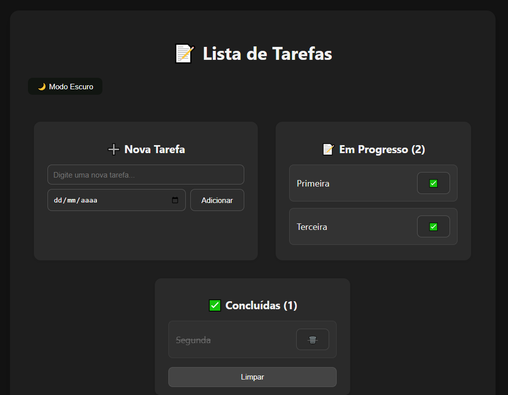

# Lista de Tarefas

Este é um projeto simples de **Lista de Tarefas (To-Do List)** feito com **HTML, CSS e JavaScript puro**. O objetivo é praticar conceitos básicos de desenvolvimento web e uso de `localStorage` para persistência de dados no navegador.

## Funcionalidades

- ✅ Adicionar nova tarefa
- ✅ Marcar tarefa como concluída
- ✅ Remover tarefa
- ✅ Armazenar as tarefas localmente (mesmo após recarregar a página)

## Captura de tela

 <!-- Você pode adicionar um print da aplicação com esse nome -->

## Como usar

1. Clone este repositório:
   ```bash
   git clone https://github.com/seu-usuario/to-do-list.git
